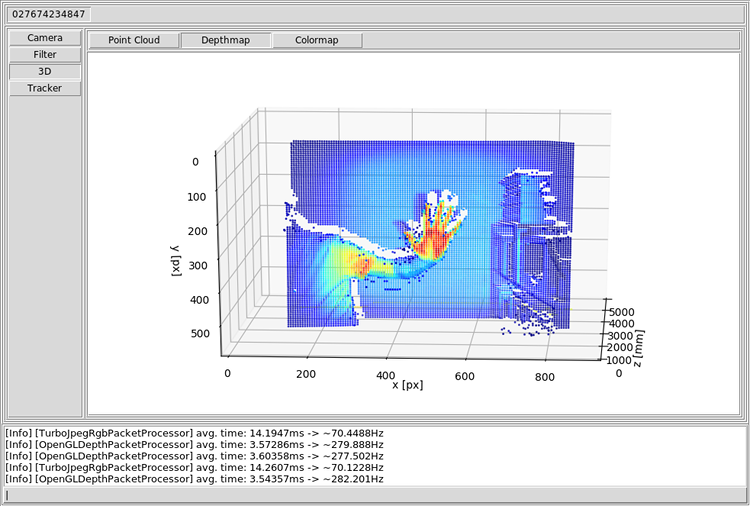

# Kinect2 along with OpenCV featuring Tk/Tcl in Action

...

## Details

...

## Usage

...

## Requirements

...

## Credits

- OpenKinect -- [Open source drivers for the Kinect for Windows v2 device (libfreenect2)](https://github.com/OpenKinect/libfreenect2)
- Ryuichi Yamamoto -- [A python interface for libfreenect2](https://github.com/r9y9/pylibfreenect2)
- Adrian Rosebrock -- [Ball Tracking with OpenCV](https://www.pyimagesearch.com/2015/09/14/ball-tracking-with-opencv/)
- Satya Mallick -- [Object Tracking using OpenCV](https://www.learnopencv.com/object-tracking-using-opencv-cpp-python/)